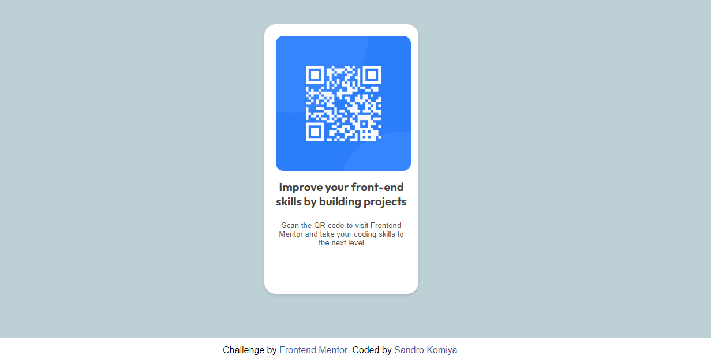

# Frontend Mentor - QR code component solution

This is a solution to the [QR code component challenge on Frontend Mentor](https://www.frontendmentor.io/challenges/qr-code-component-iux_sIO_H). Frontend Mentor challenges help you improve your coding skills by building realistic projects. 

## Table of contents

- [Overview](#overview)
  - [Screenshot](#screenshot)
  - [Links](#links)
- [My process](#my-process)
  - [Built with](#built-with)
  - [What I learned](#what-i-learned)
  - [Continued development](#continued-development)
  - [Useful resources](#useful-resources)
- [Author](#author)
- [Acknowledgments](#acknowledgments)

**Note: Delete this note and update the table of contents based on what sections you keep.**

## Overview

### Screenshot

## My process

### Built with

- Semantic HTML5 markup
- CSS custom properties
- Flexbox
- CSS Grid

### Continued development

Em um mundo onde a única constante é a mudança, o desejo de continuar focando em novos aprendizados e projetos com HTML e CSS é mais do que uma aspiração; é um compromisso com a excelência, com a criação de experiências digitais memoráveis e com a busca eterna pela perfeição no mundo em constante transformação da web.

In a world where the only constant is change, the desire to continue focusing on new learning and projects with HTML and CSS is more than an aspiration; it is a commitment to excellence, to creating memorable digital experiences, and to the eternal pursuit of perfection in the ever-changing world of the web.

## Author

- Frontend Mentor - [@sandrokomiya](https://www.frontendmentor.io/profile/sandrokomiya)
- Linkedin - [Sandro-komiya](https://www.linkedin.com/in/sandro-komiya/)
